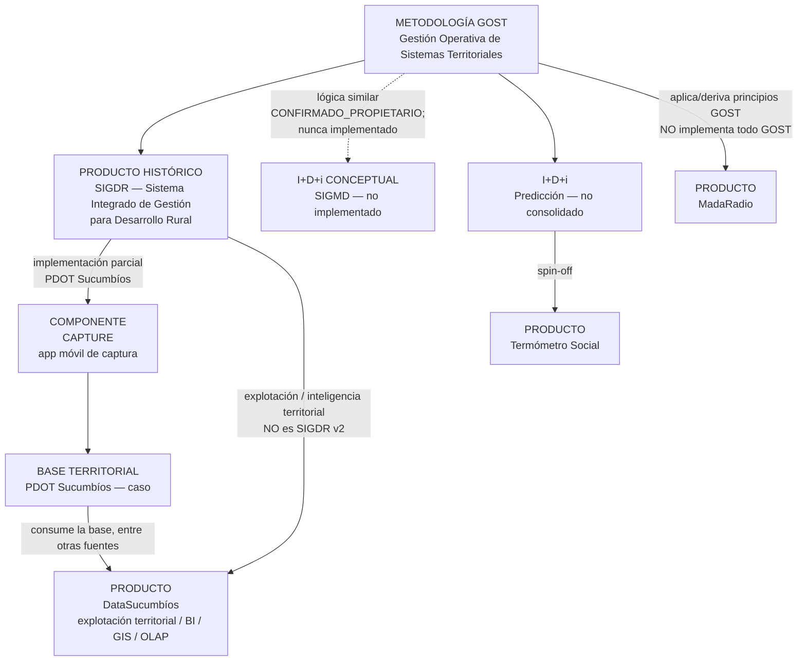
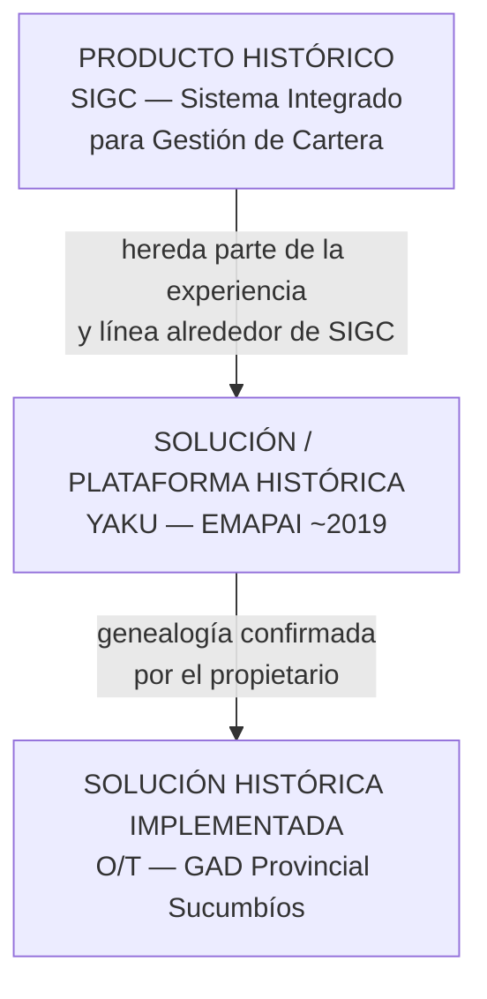
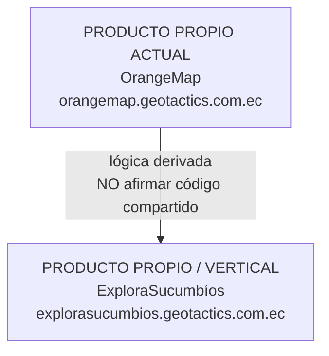
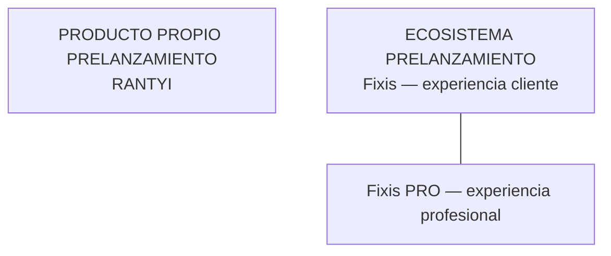
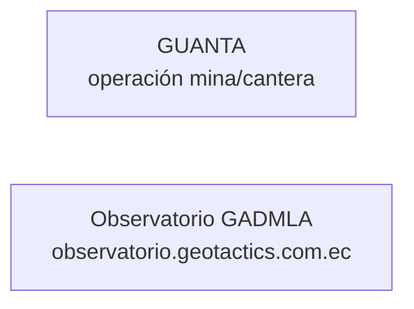

# Genealogía de soluciones GeoTactics

```
SOURCE OF TRUTH — GEOTACTICS CORPORATE 2.0
Versión: 1.0
Fecha: 18 septiembre 2026
```

**Documento:** `GEOTACTICS_PRODUCT_LINEAGE_2008_2026.md`  
**Versión documental:** 1.6.1  

**2008 (dos niveles):** concepción inicial de GOST atribuida por Jhony Daniel Orellana Torres a su experiencia en Plan Ecuador = CONFIRMADO_PROPIETARIO. Evidencia documental independiente del año 2008 = PENDIENTE. Primera materialización/documentación localizada = 2017. **No publicar** “GeoTactics/GOST desde 2008” como hecho documentalmente probado.

**Leyenda del grafo**

- trazo continuo + texto sin marca = **CONFIRMADO_PROPIETARIO** o **CONFIRMADO_DOCUMENTO**  
- `-.->` = **INFERIDO**  
- `---` + `[por validar]` = **PENDIENTE**

---

## 1. Familias (no una sola línea temporal)

### 1.1 Territorio / GOST (parcial)



**Flujo de datos confirmado (no invertir):**

```
CAPTURE
   ↓
BASE TERRITORIAL
   ↓
DATASUCUMBÍOS
```

DataSucumbíos **consume** la base generada/alimentada por CAPTURE, entre otras fuentes. **No** se representa DataSucumbíos → Base Territorial.

**Relación conceptual simultánea (no es cadena de reemplazo):**

```
SIGDR
 ├─ CAPTURE = captura en implementación parcial
 └─ DataSucumbíos = explotación / inteligencia territorial
```

DataSucumbíos **NO** es SIGDR v2.

**Prohibido en diagrama público:** `SIGDR → CAPTURE → DataSucumbíos` como productos que se sustituyen.

Evolución futura hacia SIGDR más integral: **CONFIRMADO_PROPIETARIO** como intención, no como producto ya entregado.

### 1.2 Agua / gestión institucional



No afirmar implementación formal de GOST dentro de YAKU.

### 1.3 Descubrimiento geográfico comercial / turismo



### 1.4 Mercado georreferenciado y oficios (sin GOST en el grafo)



RANTYI y Fixis **no** se cuelgan de GOST en este documento.

### 1.5 Otros productos propios (sin arista GOST)



Nodos independientes hasta confirmación de padre metodológico. **MadaRadio** no está aquí: arista GOST en §1.1 (aplica principios; no es GOST-software).

---

## 2. Tabla de aristas

| Origen | Destino | Tipo de relación | Nivel |
|---|---|---|---|
| GOST | SIGDR | fundamento metodológico / materialización temprana | CONFIRMADO_PROPIETARIO |
| SIGDR | CAPTURE | CAPTURE = capa móvil en implementación **parcial** SIGDR | CONFIRMADO_PROPIETARIO |
| SIGDR | DataSucumbíos | genealogía **conceptual**; no “v2” | CONFIRMADO_PROPIETARIO |
| CAPTURE | base territorial PDOT | una de las fuentes de la base | CONFIRMADO_PROPIETARIO |
| base territorial | DataSucumbíos | DataSucumbíos **consume** la base (entre otras fuentes) | CONFIRMADO_PROPIETARIO |
| GOST | Predicción | aplicación de principios GOST a procesos electorales | CONFIRMADO_PROPIETARIO |
| Predicción | Termómetro Social | spin-off | CONFIRMADO_PROPIETARIO |
| GOST | Termómetro Social | otra aplicación de GOST | CONFIRMADO_PROPIETARIO |
| GOST | MadaRadio | aplica/deriva principios metodológicos GOST (no implementa todo GOST; no es GOST como software) | CONFIRMADO_PROPIETARIO |
| SIGC | YAKU | hereda experiencia / línea SIGC | CONFIRMADO_PROPIETARIO |
| YAKU | O/T | deriva conceptualmente | CONFIRMADO_PROPIETARIO |
| GOST | SIGMD | lógica similar a SIGDR; no implementado | CONFIRMADO_PROPIETARIO (concepto) |
| OrangeMap | ExploraSucumbíos | vertical / lógica derivada | CONFIRMADO_PROPIETARIO |
| OrangeMap | ExploraSucumbíos | código compartido | PENDIENTE (no afirmar) |
| Fixis | Fixis PRO | mismo ecosistema, dos superficies | CONFIRMADO_PROPIETARIO |
| GOST | YAKU | implementación formal GOST | no afirmar |
| GOST | OrangeMap / RANTYI / Fixis / GUANTA / Observatorio | — | no conectar |

---

## 3. Casos ≠ nodos de producto

Los siguientes son **implementaciones**, no productos distintos:

- Comuna Gualsaqui → instancia SIGDR  
- GADPR Vacas Galindo → instancia SIGDR  
- GADPR Dayuma → instancia SIGDR  
- GADPR Inés Arango → instancia SIGDR  
- Junta Pimampiro (JAAPP) → instancia SIGC  
- Junta La Victoria (JALV) → instancia SIGC  
- EMAPAI → programa que incluye modernización comercial/SIGC y YAKU  
- GAD Provincial de Sucumbíos / PDOT 2023–2038 → caso; hospeda CAPTURE, monitoreo BI y DataSucumbíos  
- Corposucumbíos / Patas a la Obra → caso RSE (no producto de catálogo)  
- Mina Guanta → cliente/contexto de producto GUANTA (no duplicar como producto)  
- MadaRadio (organización) → contexto del producto MadaRadio  

---

## 4. Qué no entra en el grafo aún

- Inqui, Ecuador Ancestral, E-GPS: `PENDIENTE_CLASIFICACION_HISTORICA`. No bloquean Fase 2. No inventar genealogía.  
- Ecuador Ancestral **no** se fusiona con ExploraSucumbíos (clientes distintos en fuentes).  
- Paper CTEA-IE-2020: estudio; no es producto.
